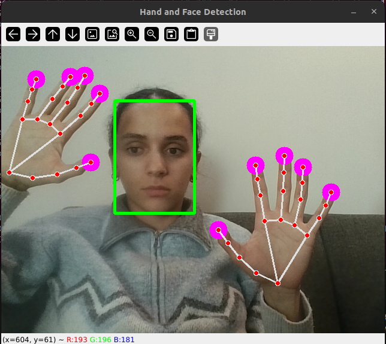
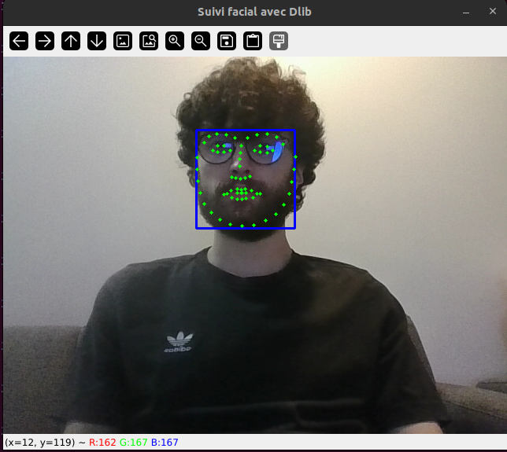

# README - Détection des visages et des mains

## Fonctionnalités
1. **Détection des visages** : Utilise un modèle DNN (Deep Neural Network) pré-entraîné d'OpenCV.
2. **Détection des mains** : Utilise Mediapipe pour détecter les mains et afficher les connexions entre leurs points clés.
3. **Points clés du visage (68 landmarks)** : Utilise Dlib pour détecter les points clés détaillés des visages.
4. **Visualisation en temps réel** : Affiche les résultats des détections dans une fenêtre vidéo.

---

## Structure du projet
- **Code principal** : `main.py`
    - Contient les fonctions pour la détection des visages et des mains ainsi que le traitement en temps réel via une webcam.
- **Code de test avec Dlib** : `test_dlib.py`
    - Détecte les visages et affiche les 68 points clés du visage à l'aide de Dlib.
- **Modèles nécessaires** :
    - `models/deploy.prototxt`
    - `models/res10_300x300_ssd_iter_140000_fp16.caffemodel`
    - `models/shape_predictor_68_face_landmarks.dat`

---

## Prérequis
1. **Logiciels** :
   - Python 3.10
2. **Bibliothèques Python** :
   - OpenCV
   - Mediapipe
   - NumPy
   - Dlib
3. **Matériel** :
   - Une webcam fonctionnelle

---

## Installation
1. **Cloner le dépôt ou copier les fichiers nécessaires.**
2. Installer les dépendances Python avec la commande :
   ```bash
   pip install opencv-python mediapipe numpy matplotlib dlib
   ```
3. Vérifier que les fichiers modèles sont présents dans le dossier `models` :
   - `.prototxt` et `.caffemodel` pour OpenCV.
   - `shape_predictor_68_face_landmarks.dat` pour Dlib.

---

## Utilisation

### Script principal
1. Exécuter le script principal :
   ```bash
   python main.py
   ```
2. Une fenêtre s'ouvrira affichant la capture de la webcam avec les détections des visages et des mains.
3. **Contrôles** :
   - Appuyer sur `ESC` pour quitter le programme.

### Script de test avec Dlib
1. Exécuter le script de test :
   ```bash
   python test_dlib.py
   ```
2. Une fenêtre s'ouvrira affichant la capture de la webcam avec les détections des visages (rectangles bleus) et les 68 points clés du visage (cercles verts).
3. **Contrôles** :
   - Appuyer sur `q` pour quitter le programme.

---

## Résultats attendus

### Script principal
- Détection en temps réel des visages avec des rectangles verts.
- Détection des mains avec des cercles sur les points clés et des connexions entre les articulations.

### Script de test avec Dlib
- Détection des visages avec des rectangles bleus.
- Affichage des 68 points clés détaillés du visage (yeux, nez, bouche, contours).

---

## Exemple de sortie

### Script principal


### Script de test avec Dlib


---

## Auteurs
- **Nom** : Marie HAMADY, Pierre TEIXEIRA
- **Cours** : MTI805 Compréhension de l’image, Hiver 2025
- **Établissement** : École de technologie supérieure (ÉTS)
